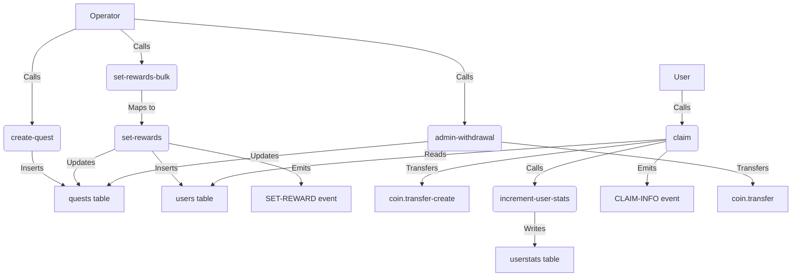

# Reward Claim Module API Documentation

This document outlines the API for the `reward-claim` Pact module, designed for managing quests and rewards on the Kadena blockchain. It provides functions for creating quests, setting and claiming rewards, tracking user statistics, and administrative withdrawals. The module uses the `free.util-fungible` library and interacts with a treasury account for reward payouts.

## Setup Instructions

To use this module, you need to pull the `kda-env` environment from the following GitHub repository:

**https://github.com/CryptoPascal31/kadena_repl_sandbox**

After setting up the environment, run tests using the `claim.repl` file:

```bash
pact claim.repl
```

This initializes the module, creates necessary tables (`users`, `quests`, `userstats`), and sets up the treasury account with the `CLAIM-GUARD`.

## Schemas

The module defines the following schemas to enforce data structures:

- **quest-schema**: Stores quest details.
  ```pact
  (defschema quest-schema
    @doc "Key value is hashed questId"
    startDate:time
    endDate:time
    amount:decimal
    winners:integer)
  ```

- **user-schema**: Tracks user rewards per quest.
  ```pact
  (defschema user-schema
    @doc "Key value is userId:questId"
    reward:decimal
    claimed:bool
    guard:guard)
  ```

- **general-stats-schema**: Aggregates user claim statistics.
  ```pact
  (defschema general-stats-schema
    @doc "Key value is userId"
    totalClaims:integer
    totalClaimed:decimal
    lastClaim:time)
  ```

- **bulk-schema**: Validates bulk reward entries.
  ```pact
  (defschema bulk-schema
    @doc "Used to check object format is correct"
    userId:string
    amount:decimal
    guard:guard)
  ```

## Function Categories

### Governance Functions (Require GOV Capability)

These functions are restricted to the governance keyset (`CLAIM_NS.governance`).

- **create-table** (Critical)
  - **Purpose**: Initializes the `users`, `quests`, and `userstats` tables.
  - **Action**: Creates tables for storing quest, user, and stats data.
  - **Usage**: Called during module setup.
  - **Example**:
    ```pact
    (create-table users)
    (create-table quests)
    (create-table userstats)
    ```

### Operational Functions (Require OPS Capability)

These functions are restricted to the operations keyset (`CLAIM_NS.ops`) and modify critical state.

- **create-quest:string (questId:string amount:decimal startDate:time endDate:time winners:integer)**
  - **Purpose**: Creates a new quest with specified parameters.
  - **Action**: Inserts a new quest into the `quests` table after validating inputs (amount > 0, winners > 0, valid dates, questId length).
  - **Usage**: Used by operators to launch new quests.
  - **Example**:
    ```pact
    (create-quest "quest123" 1000.0 (time "2025-05-01T00:00:00Z") (time "2025-06-01T00:00:00Z") 50)
    ```
    **Payload**:
    ```json
    {
      "questId": "quest123",
      "amount": 1000.0,
      "startDate": "2025-05-01T00:00:00Z",
      "endDate": "2025-06-01T00:00:00Z",
      "winners": 50
    }
    ```

- **set-rewards:string (questId:string userId:string guard:guard amount:decimal)**
  - **Purpose**: Assigns a reward to a user for a specific quest.
  - **Action**: Updates the `quests` table (reduces `amount` and `winners`) and inserts a reward record into the `users` table after validating quest state, amount, and guard.
  - **Usage**: Used by operators to distribute rewards to users.
  - **Events**: Emits `SET-REWARD` event.
  - **Example**:
    ```pact
    (set-rewards "quest123" "user1" { "keys": ["key1"], "pred": "keys-all" } 10.0)
    ```
    **Payload**:
    ```json
    {
      "questId": "quest123",
      "userId": "user1",
      "guard": { "keys": ["key1"], "pred": "keys-all" },
      "amount": 10.0
    }
    ```

- **set-rewards-bulk:string (questId:string reward-entries:[object{bulk-schema}])**
  - **Purpose**: Assigns rewards to multiple users for a quest by calling `set-rewards`.
  - **Action**: Maps over `reward-entries`, invoking `set-rewards` for each, after checking for non-empty input.
  - **Usage**: Used by operators for batch reward distribution.
  - **Events**: Emits `SET-REWARD` events via `set-rewards`.
  - **Example**:
    ```pact
    (set-rewards-bulk "quest123" [
      { "userId": "user1", "amount": 10.0, "guard": { "keys": ["key1"], "pred": "keys-all" } },
      { "userId": "user2", "amount": 15.0, "guard": { "keys": ["key2"], "pred": "keys-all" } }
    ])
    ```
    **Payload**:
    ```json
    {
      "questId": "quest123",
      "reward-entries": [
        { "userId": "user1", "amount": 10.0, "guard": { "keys": ["key1"], "pred": "keys-all" } },
        { "userId": "user2", "amount": 15.0, "guard": { "keys": ["key2"], "pred": "keys-all" } }
      ]
    }
    ```

- **admin-withdrawal:string (questId:string receiver:string)**
  - **Purpose**: Allows an admin to withdraw remaining funds from a quest’s escrow to a specified receiver.
  - **Action**: Transfers the quest’s remaining `amount` from `CLAIM-ACCOUNT` to the `receiver`, updates the `quests` table to set `amount` to 0, and validates sufficient treasury funds.
  - **Usage**: Used by operators to reclaim unallocated quest funds.
  - **Example**:
    ```pact
    (admin-withdrawal "quest123" "admin-account")
    ```
    **Payload**:
    ```json
    {
      "questId": "quest123",
      "receiver": "admin-account"
    }
    ```

### User Action Functions (Require USER-PROOF Capability)

These functions are executed by users to claim rewards.

- **claim:bool (userId:string questId:string)**
  - **Purpose**: Allows a user to claim their reward for a quest.
  - **Action**: Transfers the reward from `CLAIM-ACCOUNT` to the user via `coin.transfer-create`, updates `userstats` via `increment-user-stats`, and emits a `CLAIM-INFO` event.
  - **Usage**: Called by users with a valid `USER-PROOF` capability (matching their guard).
  - **Example**:
    ```pact
    (claim "user1" "quest123")
    ```
    **Payload**:
    ```json
    {
      "userId": "user1",
      "questId": "quest123"
    }
    ```

### Internal Functions (Require CLAIMABLE Capability)

These functions support internal state updates.

- **increment-user-stats (userId:string questId:string reward:decimal)**
  - **Purpose**: Updates a user’s claim statistics (total claims, total claimed, last claim time).
  - **Action**: Writes to the `userstats` table, incrementing `totalClaims` and `totalClaimed`, and updating `lastClaim`.
  - **Usage**: Called internally by `claim` to track user activity.
  - **Example**: Not directly called; invoked within `claim`.

### Read-Only Functions

These functions retrieve data without modifying state.

- **get-user-claim:decimal (userId:string questId:string)**: Returns the user's reward amount if one exists for the quest.
- **get-user-stats:object{general-stats-schema} (userId:string)**: Returns a user’s claim statistics (total claims, total amount claimed, last claim).
- **get-treasury:string ()**: Returns the treasury account address (`CLAIM-ACCOUNT`).
- **treasury-balance:decimal ()**: Returns the current balance of the treasury account.
- **curr-time:time ()**: Returns the current block time from chain data.
- **user-key:string (userId:string questId:string)**: Formats a composite key (`userId:questId`) for the `users` table.
- **get-quest:object{quest-schema} (questId:string)**: Returns the quest details.

### Helper Functions

These validate inputs or compute values but do not modify state.

- **validate-string:bool (str:string min-length:integer)**: Ensures a string is non-empty and meets a minimum length.
- **validate-winning:bool (reward:decimal userId:string questId:string claimed:bool)**: Verifies a reward is valid, not claimed, and the treasury has sufficient funds.
- **validate-quest:bool (amount:decimal startDate:time endDate:time winners:integer)**: Validates quest creation parameters.
- **validate-set-rewards:bool (ed:time qa:decimal amount:decimal w:integer)**: Checks quest state for reward assignment.

## Function Flow Diagram

Below is a diagram showing the interaction between key functions:



## Notes for Developers

- **Capabilities**:
  - `GOV`: Required for governance and upgrades.
  - `OPS`: Required for quest creation, reward assignment, and admin withdrawals.
  - `USER-PROOF`: Ensures users can only claim their own rewards.
  - `CLAIMABLE`: Used internally for stats updates and reward claims.
- **Guards**: Users must provide their guard (e.g., `{ "keys": ["user-key"], "pred": "keys-all" }`) when rewards are set or claimed. For bulk operations, ensure guards match the `users` table.
- **Testing**: Use `claim.repl` to run tests, which sets up tables, creates a sample quest, assigns rewards, simulates claims, and tests admin withdrawals.
- **Forking**: Extend the module by adding new quest types or reward conditions.

For issues or contributions, please open a pull request or issue on the repository.
